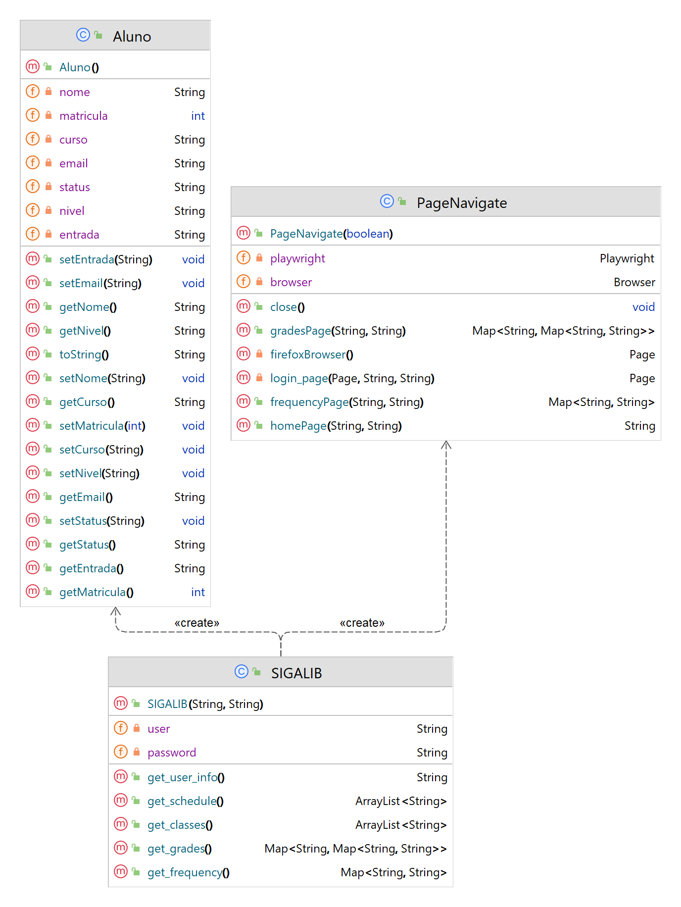

# SIGALIB

**Artigo:** https://andersonvd.medium.com/sigalib-biblioteca-java-para-acessar-o-si-b9990501a092?postPublishedType=repub

Biblioteca para acesso aos recursos do sistema SIGAA do Instituto Federal Catarinense - Campus Rio do Sul.
No primeiro uso as bibliotecas do playwrigth serão baixadas e instaladas, isso pode demorar um pouco.

## Objeto

- [x] `Sigaa(username, password)` - Realiza o login no sistema SIGAA e instancia a biblioteca.
- [ ] Implementar o cache para pegar os dados através do HTML que será salvo depois da execução do script.

## Diagrama de classe do projeto

Onde a classe SIGALIB é a classe principal e a classe PageNavigate é onde acontece todo o tratamendo da execução dos comandos na página do navegador web.

## Métodos

- [x] `get_classes()` - Retorna um dicionário com as informações do usuário logado.
- [x] `get_frequency()` - Retorna um dicionário com a frequencia de todas as matérias.
- [x] `get_grades()` - Retorna um dicionário com as notas de todas as matérias.
- [x] `get_schedule()` - Retorna um dicionário com o horário de todas as matérias.
- [ ] `get_news()` - Retorna um dicionário com as últimas notícias do campus.
- [x] `get_user_info()` - Retorna um dicionário com as informações do usuário logado.
